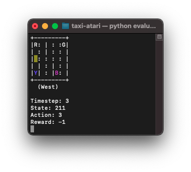

# Reinforcement Q-Learning with OpenAI Gym

From [this good article](https://www.learndatasci.com/tutorials/reinforcement-q-learning-scratch-python-openai-gym/).

Code rewritten and improved.

Enjoy! :)

## Legend

 - `|` wall
 - gray `RGBY` empty locations
 - blue `RGBY` the passenger calling the taxi
 - magenta `RGBY` the destination of the passenger
 - `:` viable road
 
## Example

From this image:

the game is done when the taxy cab picks up the passenger (blue Y) and drops it in its destination (magenta B).

## Usage

There are two strategies:

  1. brute force solution, run: `python brute_force.py`
  2. Q Learning solution:
    a. Train a Q Table, run: `python train.py`
    b. Run the game with trained table, run: `python evaluate.py`
